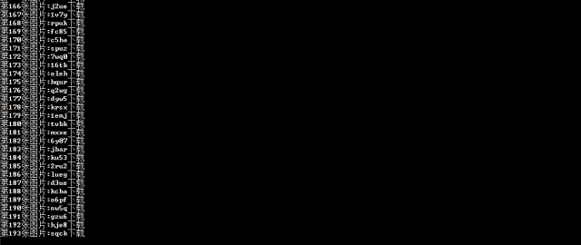
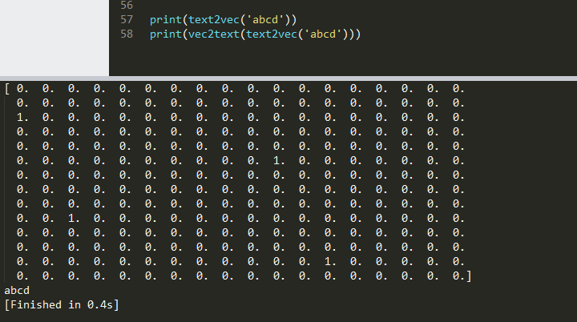
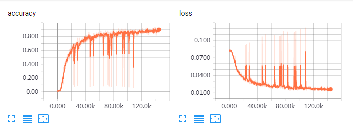
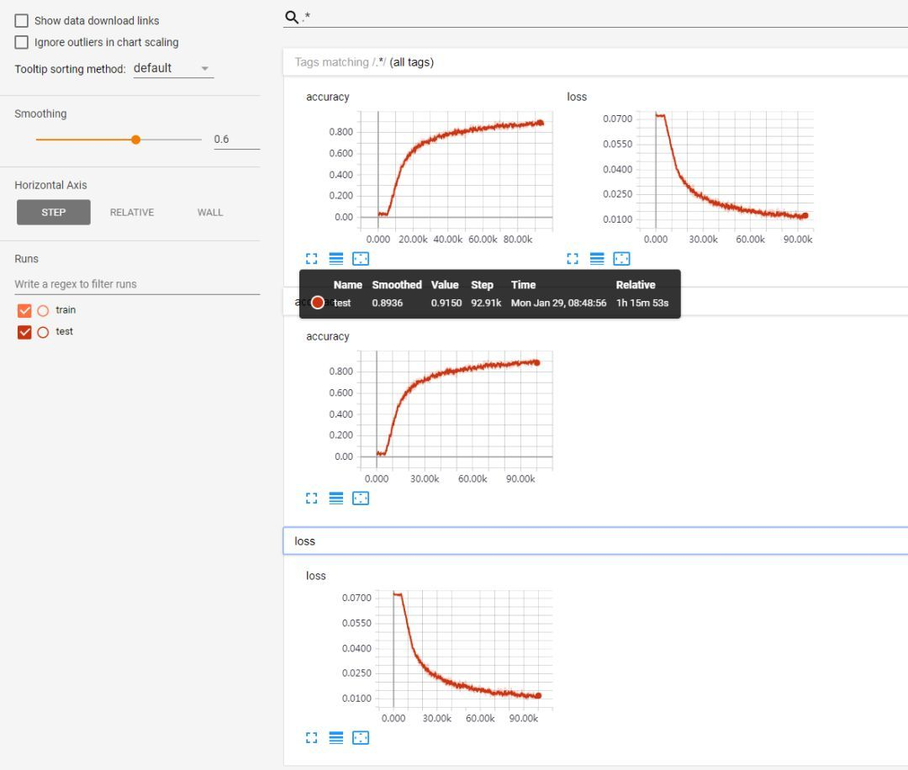
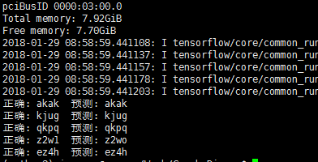

#### refer: https://cloud.tencent.com/developer/article/1052886


验证码是根据随机字符生成一幅图片，然后在图片中加入干扰象素，用户必须手动填入，防止有人利用机器人自动批量注册、灌水、发垃圾广告等等 。验证码的作用是验证用户是真人还是机器人。本文将使用深度学习框架Tensorflow训练出一个用于破解Discuz验证码的模型。

背景介绍

我们先看下简单的Discuz验证码


观察上述链接，你会发现label后面跟着的就是要显示的图片字母，改变label后面的值，我们就可以获得不同的Discuz验证码图片。如果会网络爬虫，我想根据这个api获取Discuz验证码图片对你来说应该很Easy。不会网络爬虫也没有关系，爬虫代码我已经为你准备好了。创建一个get_discuz.py文件，添加如下代码
```angular2
#-*- coding:utf-8 -*-
    from urllib.request import urlretrieve
    import time, random, os
    
    class Discuz():
      def __init__(self):
        # Discuz验证码生成图片地址
        self.url = 'http://cuijiahua.com/tutrial/discuz/index.php?label='

      def random_captcha_text(self, captcha_size = 4):
        """
        验证码一般都无视大小写；验证码长度4个字符
        Parameters:
          captcha_size:验证码长度
        Returns:
          captcha_text:验证码字符串
        """
        number = ['0','1','2','3','4','5','6','7','8','9']
        alphabet = ['a','b','c','d','e','f','g','h','i','j','k','l','m','n','o','p','q','r','s','t','u','v','w','x','y','z']
        char_set = number + alphabet
        captcha_text = []
        for i in range(captcha_size):
          c = random.choice(char_set)
          captcha_text.append(c)
        captcha_text = ''.join(captcha_text)
        return captcha_text
    
      def download_discuz(self, nums = 5000):
        """
        下载验证码图片
        Parameters:
          nums:下载的验证码图片数量
        """
        dirname = './Discuz'
        if dirname not in os.listdir():
          os.mkdir(dirname)
        for i in range(nums):
          label = self.random_captcha_text()
          print('第%d张图片:%s下载' % (i + 1,label))
          urlretrieve(url = self.url + label, filename = dirname + '/' + label + '.jpg')
          # 请至少加200ms延时，避免给我的服务器造成过多的压力，如发现影响服务器正常工作，我会关闭此功能。
          # 你好我也好，大家好才是真的好！
          time.sleep(0.2)
        print('恭喜图片下载完成！')

    if __name__ == '__main__':
      dz = Discuz()
      dz.download_discuz()
```


运行上述代码，你就可以下载5000张Discuz验证码图片到本地，但是要注意的一点是：请至少加200ms延时，避免给我的服务器造成过多的压力，如发现影响服务器正常工作，我会关闭此功能。
你好我也好，大家好才是真的好！
验证码下载过程如下图所示：


当然，如果你想省略麻烦的下载步骤也是可以的，我已经为大家准备好了6万张的Discuz验证码图片。我想应该够用了吧，如果感觉不够用，可以自行使用爬虫程序下载更多的验证码。6万张的Discuz验证码图片可到

```
http://cuijiahua.com/wp-content/themes/begin/down.php?id=2772下载。准备好的数据集，它们都是100*30大小的图片：
```
什么？你说这个图片识别太简单？没关系，有高难度的！
我打开的图片如下所示：


这是一个动图，并且还带倾斜、扭曲等特效。怎么通过api获得这种图片呢？
```angular2
http://cuijiahua.com/tutrial/discuz/index.php?label=jack&width=100&height=30&background=1&adulterate=1&ttf=1&angle=1&warping=1&scatter=1&color=1&size=1&shadow=1&animator=1
```

```angular2
没错，只要添加一些参数就可以了，格式如上图所示，每个参数的说明如下：
 - label：验证码 
 - width：验证码宽度 
 - height：验证码高度 
 - background：是否随机图片背景
 - adulterate：是否随机背景图形 
 - ttf：是否随机使用ttf字体 
 - angle：是否随机倾斜度 
 - warping：是否随机扭曲
 - scatter：是否图片打散 
 - color：是否随机颜色 
 - size：是否随机大小 
 - shadow：是否文字阴影
 - animator：是否GIF动画
你可以根据你的喜好，定制你想要的验证码图片。
不过，为了简单起见，我们只使用最简单的验证码图片进行验证码识别。数据集已经准备好，那么接下来进入本文的重点，Tensorflow实战。
```

```angular2
Discuz验证码识别

我们已经将验证码下载好，并且文件名就是对应图片的标签。这里需要注意的是：我们忽略了图片中英文的大小写。

1.数据预处理

首先，数据预处理分为两个部分，第一部分是读取图片，并划分训练集和测试集。因为整个数据集为6W张图片，所以我们可以让训练集为5W张，测试集为1W张。随后，虽然标签是文件名，我们认识，但是机器是不认识的，因此我们要使用text2vec，将标签进行向量化。明确了目的，那开始实践吧！

读取数据：
我们通过定义rate，来确定划分比例。例如：测试集1W张，训练集5W张，那么rate=1W/5W=0.2。
```
```angular2
def get_imgs(rate = 0.2):
      """
      获取图片，并划分训练集和测试集
      Parameters:
        rate:测试集和训练集的比例，即测试集个数/训练集个数
      Returns:
        test_imgs:测试集
        test_labels:测试集标签
        train_imgs:训练集
        test_labels:训练集标签
      """
      data_path = './Discuz'
      # 读取图片
      imgs = os.listdir(data_path)
      # 打乱图片顺序
      random.shuffle(imgs)
    
      # 数据集总共个数
      imgs_num = len(imgs)
      # 按照比例求出测试集个数
      test_num = int(imgs_num * rate / (1 + rate))
      # 测试集
      test_imgs = imgs[:test_num]
      # 根据文件名获取测试集标签
      test_labels = list(map(lambda x: x.split('.')[0], test_imgs))
      # 训练集
      train_imgs = imgs[test_num:]
      # 根据文件名获取训练集标签
      train_labels = list(map(lambda x: x.split('.')[0], train_imgs))
    
      return test_imgs, test_labels, train_imgs, train_labels
```
```
标签向量化：

既然需要将标签向量化，那么，我们也需要将向量化的标签还原回来。
```

```angular2
import numpy as np
    def text2vec(text):
      """
      文本转向量
      Parameters:
        text:文本
      Returns:
        vector:向量
      """
      if len(text) > 4:
        raise ValueError('验证码最长4个字符')
    
        vector = np.zeros(4 * 63)
      def char2pos(c):
        if c =='_':
          k = 62
          return k
        k = ord(c) - 48
        if k > 9:
          k = ord(c) - 55
          if k > 35:
            k = ord(c) - 61
            if k > 61:
              raise ValueError('No Map') 
        return k
      for i, c in enumerate(text):
        idx = i * 63 + char2pos(c)
        vector[idx] = 1
      return vector

    def vec2text(vec):
      """
      向量转文本
      Parameters:
        vec:向量
      Returns:
        文本
      """
      char_pos = vec.nonzero()[0]
      text = []
      for i, c in enumerate(char_pos):
        char_at_pos = i #c/63
        char_idx = c % 63
        if char_idx < 10:
          char_code = char_idx + ord('0')
        elif char_idx < 36:
          char_code = char_idx - 10 + ord('A')
        elif char_idx < 62:
          char_code = char_idx - 36 + ord('a')
        elif char_idx == 62:
          char_code = ord('_')
        else:
          raise ValueError('error')
        text.append(chr(char_code))
      return "".join(text)
    
    print(text2vec('abcd'))
    print(vec2text(text2vec('abcd')))
```

```
运行上述测试代码，你会发现，文本向量化竟如此简单：
```


```angular2
这里我们包括了63个字符的转化，0-9 a-z A-Z _(验证码如果小于4，用_补齐)。

2.根据batch_size获取数据

我们在训练模型的时候，需要根据不同的batch_size"喂"数据。这就需要我们写个函数，从整体数据集中获取指定batch_size大小的数据。
```

```angular2
def get_next_batch(self, train_flag=True, batch_size=100):
      """
      获得batch_size大小的数据集
      Parameters:
        batch_size:batch_size大小
        train_flag:是否从训练集获取数据
      Returns:
        batch_x:大小为batch_size的数据x
        batch_y:大小为batch_size的数据y
      """
      # 从训练集获取数据
      if train_flag == True:
        if (batch_size + self.train_ptr) < self.train_size:
          trains = self.train_imgs[self.train_ptr:(self.train_ptr + batch_size)]
          labels = self.train_labels[self.train_ptr:(self.train_ptr + batch_size)]
          self.train_ptr += batch_size
        else:
          new_ptr = (self.train_ptr + batch_size) % self.train_size
          trains = self.train_imgs[self.train_ptr:] + self.train_imgs[:new_ptr]
          labels = self.train_labels[self.train_ptr:] + self.train_labels[:new_ptr]
          self.train_ptr = new_ptr
    
        batch_x = np.zeros([batch_size, self.heigth*self.width])
        batch_y = np.zeros([batch_size, self.max_captcha*self.char_set_len])
    
        for index, train in enumerate(trains):
          img = np.mean(cv2.imread(self.data_path + train), -1)
          # 将多维降维1维
          batch_x[index,:] = img.flatten() / 255
        for index, label in enumerate(labels):
          batch_y[index,:] = self.text2vec(label)
    
      # 从测试集获取数据
      else:
        if (batch_size + self.test_ptr) < self.test_size:
          tests = self.test_imgs[self.test_ptr:(self.test_ptr + batch_size)]
          labels = self.test_labels[self.test_ptr:(self.test_ptr + batch_size)]
          self.test_ptr += batch_size
        else:
          new_ptr = (self.test_ptr + batch_size) % self.test_size
          tests = self.test_imgs[self.test_ptr:] + self.test_imgs[:new_ptr]
          labels = self.test_labels[self.test_ptr:] + self.test_labels[:new_ptr]
          self.test_ptr = new_ptr
    
        batch_x = np.zeros([batch_size, self.heigth*self.width])
        batch_y = np.zeros([batch_size, self.max_captcha*self.char_set_len])
    
        for index, test in enumerate(tests):
          img = np.mean(cv2.imread(self.data_path + test), -1)
          # 将多维降维1维
          batch_x[index,:] = img.flatten() / 255
        for index, label in enumerate(labels):
          batch_y[index,:] = self.text2vec(label)      
    
      return batch_x, batch_y
```

```angular2
上述代码无法运行，这是我封装到类里的函数，整体代码会在文末放出。现在理解下这代码，我们通过train_flag来确定是从训练集获取数据还是测试集获取数据，通过batch_size来获取指定大小的数据。获取数据之后，将batch_size大小的图片数据和经过向量化处理的标签存放到numpy数组中。

3.CNN模型

网络模型如下：3卷积层+1全链接层。

继续看下我封装到类里的函数：
```

```angular2
def crack_captcha_cnn(self, w_alpha=0.01, b_alpha=0.1):
        """
        定义CNN
        Parameters:
          w_alpha:权重系数
          b_alpha:偏置系数
        Returns:
          out:CNN输出
        """
        # 卷积的input: 一个Tensor。数据维度是四维[batch, in_height, in_width, in_channels]
        # 具体含义是[batch大小, 图像高度, 图像宽度, 图像通道数]
        # 因为是灰度图，所以是单通道的[?, 100, 30, 1]
        x = tf.reshape(self.X, shape=[-1, self.heigth, self.width, 1])
        # 卷积的filter:一个Tensor。数据维度是四维[filter_height, filter_width, in_channels, out_channels]
        # 具体含义是[卷积核的高度, 卷积核的宽度, 图像通道数, 卷积核个数]
        w_c1 = tf.Variable(w_alpha*tf.random_normal([3, 3, 1, 32]))
        # 偏置项bias
        b_c1 = tf.Variable(b_alpha*tf.random_normal([32]))  
        # conv2d卷积层输入:
        #  strides: 一个长度是4的一维整数类型数组，每一维度对应的是 input 中每一维的对应移动步数
        #  padding：一个字符串，取值为 SAME 或者 VALID 前者使得卷积后图像尺寸不变, 后者尺寸变化
        # conv2d卷积层输出:
        #   一个四维的Tensor, 数据维度为 [batch, out_width, out_height, in_channels * out_channels]
        #  [?, 100, 30, 32]
        #   输出计算公式H0 = (H - F + 2 * P) / S + 1
        #    对于本卷积层而言,因为padding为SAME,所以P为1。
        #  其中H为图像高度,F为卷积核高度,P为边填充,S为步长
        # 学习参数:
        #  32*(3*3+1)=320
        # 连接个数:
        #  100*30*30*100=9000000个连接
    
        # bias_add:将偏差项bias加到value上。这个操作可以看做是tf.add的一个特例，其中bias是必须的一维。
        # 该API支持广播形式，因此value可以是任何维度。但是，该API又不像tf.add，可以让bias的维度和value的最后一维不同，
        conv1 = tf.nn.relu(tf.nn.bias_add(tf.nn.conv2d(x, w_c1, strides=[1, 1, 1, 1], padding='SAME'), b_c1))
        # max_pool池化层输入：
        #  ksize:池化窗口的大小，取一个四维向量，一般是[1, height, width, 1]
        #    因为我们不想在batch和channels上做池化，所以这两个维度设为了1
        #  strides:和卷积类似，窗口在每一个维度上滑动的步长，一般也是[1, stride,stride, 1]
        #  padding:和卷积类似，可以取'VALID' 或者'SAME'
        # max_pool池化层输出：
        #  返回一个Tensor，类型不变，shape仍然是[batch, out_width, out_height, in_channels]这种形式
        #   [?, 50, 15, 32]
        # 学习参数:
        #  2*32
        # 连接个数:
        #  15*50*32*(2*2+1)=120000
        conv1 = tf.nn.max_pool(conv1, ksize=[1, 2, 2, 1], strides=[1, 2, 2, 1], padding='SAME')
        w_c2 = tf.Variable(w_alpha*tf.random_normal([3, 3, 32, 64]))
        b_c2 = tf.Variable(b_alpha*tf.random_normal([64]))
        # [?, 50, 15, 64]
        conv2 = tf.nn.relu(tf.nn.bias_add(tf.nn.conv2d(conv1, w_c2, strides=[1, 1, 1, 1], padding='SAME'), b_c2))
        # [?, 25, 8, 64]
        conv2 = tf.nn.max_pool(conv2, ksize=[1, 2, 2, 1], strides=[1, 2, 2, 1], padding='SAME')
        w_c3 = tf.Variable(w_alpha*tf.random_normal([3, 3, 64, 64]))
        b_c3 = tf.Variable(b_alpha*tf.random_normal([64]))
        # [?, 25, 8, 64]
        conv3 = tf.nn.relu(tf.nn.bias_add(tf.nn.conv2d(conv2, w_c3, strides=[1, 1, 1, 1], padding='SAME'), b_c3))
        # [?, 13, 4, 64]
        conv3 = tf.nn.max_pool(conv3, ksize=[1, 2, 2, 1], strides=[1, 2, 2, 1], padding='SAME')
        # [3328, 1024]
        w_d = tf.Variable(w_alpha*tf.random_normal([4*13*64, 1024]))
        b_d = tf.Variable(b_alpha*tf.random_normal([1024]))
        # [?, 3328]
        dense = tf.reshape(conv3, [-1, w_d.get_shape().as_list()[0]])
        # [?, 1024]
        dense = tf.nn.relu(tf.add(tf.matmul(dense, w_d), b_d))
        dense = tf.nn.dropout(dense, self.keep_prob)
        # [1024, 63*4=252]
        w_out = tf.Variable(w_alpha*tf.random_normal([1024, self.max_captcha*self.char_set_len]))
    
        b_out = tf.Variable(b_alpha*tf.random_normal([self.max_captcha*self.char_set_len]))
        # [?, 252]
        out = tf.add(tf.matmul(dense, w_out), b_out)
        return out
```

```angular2
为了省事，name_scope什么都没有设定。
每个网络层的功能，维度都已经在注释里写清楚了，甚至包括tensorflow相应函数的说明也注释好了。
如果对于网络结构计算不太了解，
推荐看下LeNet-5网络解析：http://cuijiahua.com/blog/2018/01/dl_3.html

LeNet-5的网络结构研究清楚了，这里也就懂了。

4.训练函数

准备工作都做好了，我们就可以开始训练了
```

```
def train_crack_captcha_cnn(self):
        """
        训练函数
        """
        output = self.crack_captcha_cnn()
    
        # 创建损失函数
        # loss = tf.reduce_mean(tf.nn.softmax_cross_entropy_with_logits(logits=output, labels=self.Y))
        diff = tf.nn.sigmoid_cross_entropy_with_logits(logits=output, labels=self.Y)
        loss = tf.reduce_mean(diff)
        tf.summary.scalar('loss', loss)
        
        # 使用AdamOptimizer优化器训练模型，最小化交叉熵损失
        optimizer = tf.train.AdamOptimizer(learning_rate=0.001).minimize(loss)
    
        # 计算准确率
        y = tf.reshape(output, [-1, self.max_captcha, self.char_set_len])
        y_ = tf.reshape(self.Y, [-1, self.max_captcha, self.char_set_len])
        correct_pred = tf.equal(tf.argmax(y, 2), tf.argmax(y_, 2))
        accuracy = tf.reduce_mean(tf.cast(correct_pred, tf.float32))
        tf.summary.scalar('accuracy', accuracy)
    
        merged = tf.summary.merge_all()
        saver = tf.train.Saver()
        with tf.Session(config=self.config) as sess:
          # 写到指定的磁盘路径中
          train_writer = tf.summary.FileWriter(self.log_dir + '/train', sess.graph)
          test_writer = tf.summary.FileWriter(self.log_dir + '/test')
          sess.run(tf.global_variables_initializer())
    
          # 遍历self.max_steps次
          for i in range(self.max_steps):
            # 迭代500次，打乱一下数据集
            if i % 499 == 0:
              self.test_imgs, self.test_labels, self.train_imgs, self.train_labels = self.get_imgs()
            # 每10次，使用测试集，测试一下准确率
            if i % 10 == 0:
              batch_x_test, batch_y_test = self.get_next_batch(False, 100)
              summary, acc = sess.run([merged, accuracy], feed_dict={self.X: batch_x_test, self.Y: batch_y_test, self.keep_prob: 1})
              print('迭代第%d次 accuracy:%f' % (i+1, acc))
              test_writer.add_summary(summary, i)
    
              # 如果准确率大于90%，则保存模型并退出。
              if acc > 0.90:
                train_writer.close()
                test_writer.close()
                saver.save(sess, "crack_capcha.model", global_step=i)
                break
            # 一直训练,不实用dropout
            else:
              batch_x, batch_y = self.get_next_batch(True, 100)
              loss_value, _ = sess.run([loss, optimizer], feed_dict={self.X: batch_x, self.Y: batch_y, self.keep_prob: 1})
              print('迭代第%d次 loss:%f' % (i+1, loss_value))
              curve = sess.run(merged, feed_dict={self.X: batch_x_test, self.Y: batch_y_test, self.keep_prob: 1})
              train_writer.add_summary(curve, i)
    
          train_writer.close()
          test_writer.close()
          saver.save(sess, "crack_capcha.model", global_step=self.max_steps)
```

```angular2
上述代码依旧是我封装到类里的函数，
与我的一篇文章《[Tensorflow实战（一）：打响深度学习的第一枪 – 手写数字识别（Tensorboard可视化）》
（http://cuijiahua.com/blog/2018/01/dl_4.html）重复的内容不再讲解，
包括Tensorboard的使用方法。
这里需要强调的一点是，我们需要在迭代到500次的时候重新获取下数据集，这样做其实就是打乱了一次数据集。为什么要打乱数据集呢？因为如果不打乱数据集，在训练的时候，Tensorboard绘图会有如下现象
```


```angular2
可以看到，准确率曲线和Loss曲线存在跳变，这就是因为我们没有在迭代一定次数之后打乱数据集造成的。
同时，虽然我定义了dropout层，但是在训练的时候没有使用它，所以才把dropout值设置为1。
5.整体训练代码

指定GPU，指定Tensorboard数据存储路径，指定最大迭代次数，跟Tensorflow实战(一)的思想都是一致的。这里，设置最大迭代次数为100W次。我使用的GPU是Titan X，如果是使用CPU训练估计会好几天吧....

创建train.py文件，添加如下代码：
```

```angular2
#-*- coding:utf-8 -*-
    import tensorflow as tf
    import matplotlib.pyplot as plt
    import numpy as np
    import os, random, cv2
    
    class Discuz():
      def __init__(self):
        # 指定GPU
        os.environ["CUDA_VISIBLE_DEVICES"] = "0"
        self.config = tf.ConfigProto(allow_soft_placement = True)
        gpu_options = tf.GPUOptions(per_process_gpu_memory_fraction = 1)
        self.config.gpu_options.allow_growth = True
        # 数据集路径
        self.data_path = './Discuz/'
        # 写到指定的磁盘路径中 
        self.log_dir = '/home/jack_cui/Work/Discuz/Tb'
        # 数据集图片大小
        self.width = 30
        self.heigth = 100
        # 最大迭代次数
        self.max_steps = 1000000
        # 读取数据集
        self.test_imgs, self.test_labels, self.train_imgs, self.train_labels = self.get_imgs()
        # 训练集大小
        self.train_size = len(self.train_imgs)
        # 测试集大小
        self.test_size = len(self.test_imgs)
        # 每次获得batch_size大小的当前训练集指针
        self.train_ptr = 0
        # 每次获取batch_size大小的当前测试集指针
        self.test_ptr = 0
        # 字符字典大小:0-9 a-z A-Z _(验证码如果小于4，用_补齐) 一共63个字符
        self.char_set_len = 63
        # 验证码最长的长度为4
        self.max_captcha = 4
        # 输入数据X占位符
        self.X = tf.placeholder(tf.float32, [None, self.heigth*self.width])
        # 输入数据Y占位符
        self.Y = tf.placeholder(tf.float32, [None, self.char_set_len*self.max_captcha])
        # keepout占位符
        self.keep_prob = tf.placeholder(tf.float32)

      def test_show_img(self, fname, show = True):
        """
        读取图片，显示图片信息并显示其灰度图
        Parameters:
          fname:图片文件名
          show:是否展示灰度图
        """
        # 获得标签
        label = fname.split('.')
        # 读取图片
        img = cv2.imread(fname)
        # 获取图片大小
        width, heigth, _ = img.shape
        print("图像宽:%s px" % width)
        print("图像高:%s px" % heigth)
    
        if show == True:
          # plt.imshow(img)
          #将fig画布分隔成1行1列,不共享x轴和y轴,fig画布的大小为(13,8)
          #当nrow=3,nclos=2时,代表fig画布被分为六个区域,axs[0][0]表示第一行第一列
          fig, axs = plt.subplots(nrows=2, ncols=1, sharex=False, sharey=False, figsize=(10,5))
          axs[0].imshow(img)
          axs0_title_text = axs[0].set_title(u'RGB img')
          plt.setp(axs0_title_text, size=10)
          # 转换为灰度图
          gray = np.mean(img, axis=-1)
          axs[1].imshow(gray, cmap='Greys_r')
          axs1_title_text = axs[1].set_title(u'GRAY img')
          plt.setp(axs1_title_text, size=10)
          plt.show()
    
      def get_imgs(self, rate = 0.2):
        """
        获取图片，并划分训练集和测试集
        Parameters:
          rate:测试集和训练集的比例，即测试集个数/训练集个数
        Returns:
          test_imgs:测试集
          test_labels:测试集标签
          train_imgs:训练集
          test_labels:训练集标签
        """
        # 读取图片
        imgs = os.listdir(self.data_path)
        # 打乱图片顺序
        random.shuffle(imgs)
    
        # 数据集总共个数
        imgs_num = len(imgs)
        # 按照比例求出测试集个数
        test_num = int(imgs_num * rate / (1 + rate))
        # 测试集
        test_imgs = imgs[:test_num]
        # 根据文件名获取测试集标签
        test_labels = list(map(lambda x: x.split('.')[0], test_imgs))
        # 训练集
        train_imgs = imgs[test_num:]
        # 根据文件名获取训练集标签
        train_labels = list(map(lambda x: x.split('.')[0], train_imgs))
    
        return test_imgs, test_labels, train_imgs, train_labels
    
      def get_next_batch(self, train_flag=True, batch_size=100):
        """
        获得batch_size大小的数据集
        Parameters:
          batch_size:batch_size大小
          train_flag:是否从训练集获取数据
        Returns:
          batch_x:大小为batch_size的数据x
          batch_y:大小为batch_size的数据y
        """
        # 从训练集获取数据
        if train_flag == True:
          if (batch_size + self.train_ptr) < self.train_size:
            trains = self.train_imgs[self.train_ptr:(self.train_ptr + batch_size)]
            labels = self.train_labels[self.train_ptr:(self.train_ptr + batch_size)]
            self.train_ptr += batch_size
          else:
            new_ptr = (self.train_ptr + batch_size) % self.train_size
            trains = self.train_imgs[self.train_ptr:] + self.train_imgs[:new_ptr]
            labels = self.train_labels[self.train_ptr:] + self.train_labels[:new_ptr]
            self.train_ptr = new_ptr
    
          batch_x = np.zeros([batch_size, self.heigth*self.width])
          batch_y = np.zeros([batch_size, self.max_captcha*self.char_set_len])
    
          for index, train in enumerate(trains):
            img = np.mean(cv2.imread(self.data_path + train), -1)
            # 将多维降维1维
            batch_x[index,:] = img.flatten() / 255
          for index, label in enumerate(labels):
            batch_y[index,:] = self.text2vec(label)
    
        # 从测试集获取数据
        else:
          if (batch_size + self.test_ptr) < self.test_size:
            tests = self.test_imgs[self.test_ptr:(self.test_ptr + batch_size)]
            labels = self.test_labels[self.test_ptr:(self.test_ptr + batch_size)]
            self.test_ptr += batch_size
          else:
            new_ptr = (self.test_ptr + batch_size) % self.test_size
            tests = self.test_imgs[self.test_ptr:] + self.test_imgs[:new_ptr]
            labels = self.test_labels[self.test_ptr:] + self.test_labels[:new_ptr]
            self.test_ptr = new_ptr
    
          batch_x = np.zeros([batch_size, self.heigth*self.width])
          batch_y = np.zeros([batch_size, self.max_captcha*self.char_set_len])
    
          for index, test in enumerate(tests):
            img = np.mean(cv2.imread(self.data_path + test), -1)
            # 将多维降维1维
            batch_x[index,:] = img.flatten() / 255
          for index, label in enumerate(labels):
            batch_y[index,:] = self.text2vec(label)      
    
        return batch_x, batch_y
    
      def text2vec(self, text):
        """
        文本转向量
        Parameters:
          text:文本
        Returns:
          vector:向量
        """
        if len(text) > 4:
          raise ValueError('验证码最长4个字符')
    
        vector = np.zeros(4 * self.char_set_len)
        def char2pos(c):
          if c =='_':
            k = 62
            return k
          k = ord(c) - 48
          if k > 9:
            k = ord(c) - 55
            if k > 35:
              k = ord(c) - 61
              if k > 61:
                raise ValueError('No Map') 
          return k
        for i, c in enumerate(text):
          idx = i * self.char_set_len + char2pos(c)
          vector[idx] = 1
        return vector
    
      def vec2text(self, vec):
        """
        向量转文本
        Parameters:
          vec:向量
        Returns:
          文本
        """
        char_pos = vec.nonzero()[0]
        text = []
        for i, c in enumerate(char_pos):
          char_at_pos = i #c/63
          char_idx = c % self.char_set_len
          if char_idx < 10:
            char_code = char_idx + ord('0')
          elif char_idx < 36:
            char_code = char_idx - 10 + ord('A')
          elif char_idx < 62:
            char_code = char_idx - 36 + ord('a')
          elif char_idx == 62:
            char_code = ord('_')
          else:
            raise ValueError('error')
          text.append(chr(char_code))
        return "".join(text)
    
      def crack_captcha_cnn(self, w_alpha=0.01, b_alpha=0.1):
        """
        定义CNN
        Parameters:
          w_alpha:权重系数
          b_alpha:偏置系数
        Returns:
          out:CNN输出
        """
        # 卷积的input: 一个Tensor。数据维度是四维[batch, in_height, in_width, in_channels]
        # 具体含义是[batch大小, 图像高度, 图像宽度, 图像通道数]
        # 因为是灰度图，所以是单通道的[?, 100, 30, 1]
        x = tf.reshape(self.X, shape=[-1, self.heigth, self.width, 1])
        # 卷积的filter:一个Tensor。数据维度是四维[filter_height, filter_width, in_channels, out_channels]
        # 具体含义是[卷积核的高度, 卷积核的宽度, 图像通道数, 卷积核个数]
        w_c1 = tf.Variable(w_alpha*tf.random_normal([3, 3, 1, 32]))
        # 偏置项bias
        b_c1 = tf.Variable(b_alpha*tf.random_normal([32]))  
        # conv2d卷积层输入:
        #  strides: 一个长度是4的一维整数类型数组，每一维度对应的是 input 中每一维的对应移动步数
        #  padding：一个字符串，取值为 SAME 或者 VALID 前者使得卷积后图像尺寸不变, 后者尺寸变化
        # conv2d卷积层输出:
        #   一个四维的Tensor, 数据维度为 [batch, out_width, out_height, in_channels * out_channels]
        #  [?, 100, 30, 32]
        #   输出计算公式H0 = (H - F + 2 * P) / S + 1
        #    对于本卷积层而言,因为padding为SAME,所以P为1。
        #  其中H为图像高度,F为卷积核高度,P为边填充,S为步长
        # 学习参数:
        #  32*(3*3+1)=320
        # 连接个数:
        #  100*30*30*100=9000000个连接
    
        # bias_add:将偏差项bias加到value上。这个操作可以看做是tf.add的一个特例，其中bias是必须的一维。
        # 该API支持广播形式，因此value可以是任何维度。但是，该API又不像tf.add，可以让bias的维度和value的最后一维不同，
        conv1 = tf.nn.relu(tf.nn.bias_add(tf.nn.conv2d(x, w_c1, strides=[1, 1, 1, 1], padding='SAME'), b_c1))
        # max_pool池化层输入：
        #  ksize:池化窗口的大小，取一个四维向量，一般是[1, height, width, 1]
        #    因为我们不想在batch和channels上做池化，所以这两个维度设为了1
        #  strides:和卷积类似，窗口在每一个维度上滑动的步长，一般也是[1, stride,stride, 1]
        #  padding:和卷积类似，可以取'VALID' 或者'SAME'
        # max_pool池化层输出：
        #  返回一个Tensor，类型不变，shape仍然是[batch, out_width, out_height, in_channels]这种形式
        #   [?, 50, 15, 32]
        # 学习参数:
        #  2*32
        # 连接个数:
        #  15*50*32*(2*2+1)=120000
        conv1 = tf.nn.max_pool(conv1, ksize=[1, 2, 2, 1], strides=[1, 2, 2, 1], padding='SAME')
        w_c2 = tf.Variable(w_alpha*tf.random_normal([3, 3, 32, 64]))
        b_c2 = tf.Variable(b_alpha*tf.random_normal([64]))
        # [?, 50, 15, 64]
        conv2 = tf.nn.relu(tf.nn.bias_add(tf.nn.conv2d(conv1, w_c2, strides=[1, 1, 1, 1], padding='SAME'), b_c2))
        # [?, 25, 8, 64]
        conv2 = tf.nn.max_pool(conv2, ksize=[1, 2, 2, 1], strides=[1, 2, 2, 1], padding='SAME')
        w_c3 = tf.Variable(w_alpha*tf.random_normal([3, 3, 64, 64]))
        b_c3 = tf.Variable(b_alpha*tf.random_normal([64]))
        # [?, 25, 8, 64]
        conv3 = tf.nn.relu(tf.nn.bias_add(tf.nn.conv2d(conv2, w_c3, strides=[1, 1, 1, 1], padding='SAME'), b_c3))
        # [?, 13, 4, 64]
        conv3 = tf.nn.max_pool(conv3, ksize=[1, 2, 2, 1], strides=[1, 2, 2, 1], padding='SAME')
        # [3328, 1024]
        w_d = tf.Variable(w_alpha*tf.random_normal([4*13*64, 1024]))
        b_d = tf.Variable(b_alpha*tf.random_normal([1024]))
        # [?, 3328]
        dense = tf.reshape(conv3, [-1, w_d.get_shape().as_list()[0]])
        # [?, 1024]
        dense = tf.nn.relu(tf.add(tf.matmul(dense, w_d), b_d))
        dense = tf.nn.dropout(dense, self.keep_prob)
        # [1024, 37*4=148]
        w_out = tf.Variable(w_alpha*tf.random_normal([1024, self.max_captcha*self.char_set_len]))
    
        b_out = tf.Variable(b_alpha*tf.random_normal([self.max_captcha*self.char_set_len]))
        # [?, 148]
        out = tf.add(tf.matmul(dense, w_out), b_out)
        # out = tf.nn.softmax(out)
        return out
    
      def train_crack_captcha_cnn(self):
        """
        训练函数
        """
        output = self.crack_captcha_cnn()
    
        # 创建损失函数
        # loss = tf.reduce_mean(tf.nn.softmax_cross_entropy_with_logits(logits=output, labels=self.Y))
        diff = tf.nn.sigmoid_cross_entropy_with_logits(logits=output, labels=self.Y)
        loss = tf.reduce_mean(diff)
        tf.summary.scalar('loss', loss)
        
        # 使用AdamOptimizer优化器训练模型，最小化交叉熵损失
        optimizer = tf.train.AdamOptimizer(learning_rate=0.001).minimize(loss)
    
        # 计算准确率
        y = tf.reshape(output, [-1, self.max_captcha, self.char_set_len])
        y_ = tf.reshape(self.Y, [-1, self.max_captcha, self.char_set_len])
        correct_pred = tf.equal(tf.argmax(y, 2), tf.argmax(y_, 2))
        accuracy = tf.reduce_mean(tf.cast(correct_pred, tf.float32))
        tf.summary.scalar('accuracy', accuracy)
    
        merged = tf.summary.merge_all()
        saver = tf.train.Saver()
        with tf.Session(config=self.config) as sess:
          # 写到指定的磁盘路径中
          train_writer = tf.summary.FileWriter(self.log_dir + '/train', sess.graph)
          test_writer = tf.summary.FileWriter(self.log_dir + '/test')
          sess.run(tf.global_variables_initializer())
    
          # 遍历self.max_steps次
          for i in range(self.max_steps):
            # 迭代500次，打乱一下数据集
            if i % 499 == 0:
              self.test_imgs, self.test_labels, self.train_imgs, self.train_labels = self.get_imgs()
            # 每10次，使用测试集，测试一下准确率
            if i % 10 == 0:
              batch_x_test, batch_y_test = self.get_next_batch(False, 100)
              summary, acc = sess.run([merged, accuracy], feed_dict={self.X: batch_x_test, self.Y: batch_y_test, self.keep_prob: 1})
              print('迭代第%d次 accuracy:%f' % (i+1, acc))
              test_writer.add_summary(summary, i)
    
              # 如果准确率大于85%，则保存模型并退出。
              if acc > 0.85:
                train_writer.close()
                test_writer.close()
                saver.save(sess, "crack_capcha.model", global_step=i)
                break
            # 一直训练
            else:
              batch_x, batch_y = self.get_next_batch(True, 100)
              loss_value, _ = sess.run([loss, optimizer], feed_dict={self.X: batch_x, self.Y: batch_y, self.keep_prob: 1})
              print('迭代第%d次 loss:%f' % (i+1, loss_value))
              curve = sess.run(merged, feed_dict={self.X: batch_x_test, self.Y: batch_y_test, self.keep_prob: 1})
              train_writer.add_summary(curve, i)
    
          train_writer.close()
          test_writer.close()
          saver.save(sess, "crack_capcha.model", global_step=self.max_steps)
          
    if __name__ == '__main__':
      dz = Discuz()
      dz.train_crack_captcha_cnn()
```

```angular2
代码跑了一个多小时终于跑完了，Tensorboard显示的数据：
```



```angular2
准确率达到百分之90以上吧。


6.测试代码

已经有训练好的模型了，怎么加载已经训练好的模型进行预测呢？在和train.py相同目录下，创建test.py文件，添加如下代码：
```

```angular2
#-*- coding:utf-8 -*-
    import tensorflow as tf
    import numpy as np
    import train
    
    def crack_captcha(captcha_image, captcha_label):
      """
      使用模型做预测
      Parameters:
        captcha_image:数据
        captcha_label:标签
      """

      output = dz.crack_captcha_cnn()
      saver = tf.train.Saver()
      with tf.Session(config=dz.config) as sess:
    
        saver.restore(sess, tf.train.latest_checkpoint('.'))
        for i in range(len(captcha_label)):
          img = captcha_image[i].flatten()
          label = captcha_label[i]
          predict = tf.argmax(tf.reshape(output, [-1, dz.max_captcha, dz.char_set_len]), 2)
          text_list = sess.run(predict, feed_dict={dz.X: [img], dz.keep_prob: 1})
          text = text_list[0].tolist()
          vector = np.zeros(dz.max_captcha*dz.char_set_len)
          i = 0
          for n in text:
              vector[i*dz.char_set_len + n] = 1
              i += 1
          prediction_text = dz.vec2text(vector)
          print("正确: {}  预测: {}".format(dz.vec2text(label), prediction_text))

    if __name__ == '__main__':
      dz = train.Discuz()
      batch_x, batch_y = dz.get_next_batch(False, 5)
      crack_captcha(batch_x, batch_y)
```

```运行程序，随机从测试集挑选5张图片，效果还行，错了一个字母：```


```angular2
总    结   

通过修改网络结构，以及超参数，学习如何调参。

可以试试其他的网络结构，准确率还可以提高很多的。
Discuz验证码可以使用更复杂的，这仅仅是个小demo。
 如有问题，请留言。如有错误，还望指正，谢谢！
本文出现的所有代码和数据集，均可在我的github上下载，欢迎Follow、Star：
http://cuijiahua.com/wp-content/themes/begin/inc/go.php?url=https://github.com/Jack-Cherish/Deep-Learning
6W张验证码下载地址(密码：d3iq)：https://pan.baidu.com/s/1mjI2Gxq
个人网站：http://cuijiahua.com
```